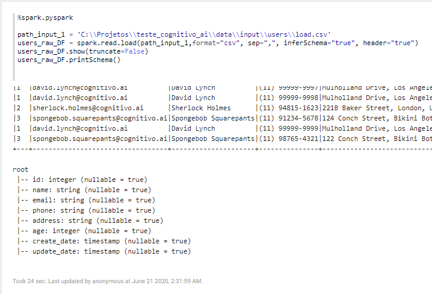
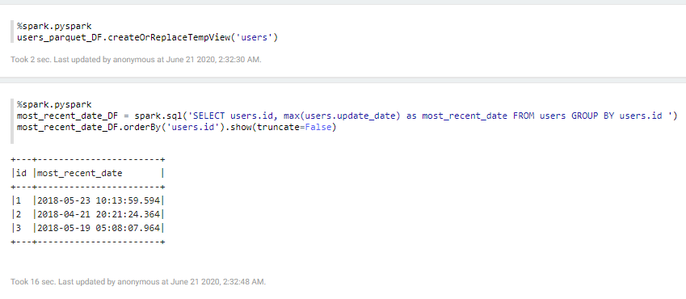

# COGNITIVO.AI - Teste Técnico

## Considerações sobre o ambiente de trabalho
*Utilizei o notebook Apache Zeppelin 0.8.2, instalado localmente em ambiente Windows 10. Já trabalhei com Jupyter e Colaboratory, mas ultimamente uso intensamente o Zeppelin devido a sua flexibilidade com os interpretadores (utilizei o intepretador Spark). Meu ambiente de trabalho contou ainda com Java 1.8.0_221, Python 3.6.5 e Spark 2.4.5 (utilizei Pyspark). O código-fonte do teste encontra-se em repositório Github https://github.com/eder1985/teste_cognitivo_ai .*

## Requisito 1
Conversão do formato dos arquivos: Converter o arquivo CSV presente no diretório data/input/users/load.csv, para um formato colunar de alta performance de leitura de sua escolha. Justificar brevemente a escolha do formato; 

*R. Utilizei o formato PARQUET, por diversas vantagens: ele é um formato colunar, binário e que contém o metadado de seu conteúdo. Então, mesmo sem ler o conteúdo do arquivo, o Spark pode saber sobre nome das colunas, tipos de dados, enconding, taxa de compressão alta, etc. Este formato é otimizado para o paradigma WORM (Write Once Read Many). Tem baixo custo de I/O e pode ser configurado para altas taxas de compressão, utilizando pouco espaço do disco.*

### Lendo o arquivo bruto

### Exibindo na ordem correta as colunas 'name' e 'email'

### Salvando no disco local no formato PARQUET

## Requisito 2: 
Deduplicação dos dados convertidos: No conjunto de dados convertidos haverão múltiplas entradas para um mesmo registro, variando apenas os valores de alguns dos campos entre elas. Será necessário realizar um processo de deduplicação destes dados, a fim de apenas manter a última entrada de cada registro, usando como referência o id para identificação dos registros duplicados e a data de atualização (update_date) para definição do registro mais recente;

### Criando tabelas temporárias e executando o join entre elas para gerar a tabela com dados deduplicados

### Salvando no disco local a tabela com dados deduplicados

# Requisito 3
Conversão do tipo dos dados deduplicados: No diretório config haverá um arquivo JSON de configuração (types_mapping.json), contendo os nomes dos campos e os respectivos tipos desejados de output. Utilizando esse arquivo como input, realizar um processo de conversão dos tipos dos campos descritos, no conjunto de dados deduplicados;

### Lendo arquivos com dados deduplicados

### Transformando o schema do Dataframe em um dicionário python

### Lendo o arquivo *types_mapping.json* com os tipos de alguns campos

### Iterando o dicionário de dados do schema original e alterando com os valores definidos no arquivo *types_mapping.json*

### Aplicando o novo schema
*Converti o schema alterado, de formato Dicionário para String e finalmente em StrutType. Após isso, recarreguei o Dataframe gerado na saída 2 já usando o novo schema alterado. Os tipos definidos no arquivo e os tipos inferidos pelo Spark foram os mesmos. Como comprovação que o schema original foi alterado, pode-se editar os tipos no arquivo json disponibilizado para 'string' e verá que os tipos são carregados desta origem.*

### Salvando o Dataframe no formato final

